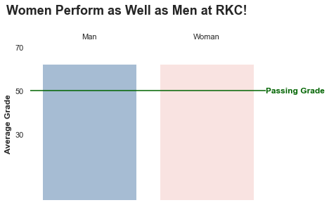

### Overview of Projects
 [1. Exploratory Analysis](#exploratory-analysis)
  [1.1 iTunes Store Data Analysis using SQL](#itunes-store-data-analysis-using-sql)
  [1.2 College Major vs Career Prospects Analysis](#college-major-vs-career-prospects-analysis)
 [2. Inferential Statistics](#inferential-statistics)
  [2.1 RKC Zurich CH Students Data Analysis](#rkc-zurich-ch-students-data-analysis)
 [3. Machine Learning](#machine-learning)
  [3.1 Car Price Prediction Using KNN Algorithm](#car-price-prediction-using-knn-algorithm)
 [4. Data Engineering](#data-engineering)
  [4.1 Building PostgreSQL Database for Crime Reports](#building-postgresql-database-for-crime-reports)
 
 
### Exploratory Analysis
#### [iTunes Store Data Analysis using SQL](https://github.com/ofeliiaB/iTunes_data_analysis/blob/master/iTunes_data_analysis.ipynb)
The project uses the Chinook SQLite database and generates insights on new music album opportunities, countries and best performing employees of the media store.

<h5>Techniques used</h5>
<ul>
  <li>SQL Joins</li>
  <li>SQL Group By</li>
  <li>SQL With statements</li>
  <li>Aggregate functions</li>
</ul>
 

#### [College Major vs Career Prospects Analysis](https://github.com/ofeliiaB/major_salary_analysis/blob/master/MajorVsSalaryAnalysis.ipynb)

<h5>Techniques used</h5>
<ul>
  <li>Data Cleaning (Pandas, NumPy)</li>
  <li>Descriptive Statistics (Central Tendency Analysis)</li>
  <li>Comparison of Frequency Distributions</li>
  <li>Exploratory Data Visualization (Matplotlib, Plotly, Seaborn)</li>
</ul>
 

### Inferential Statistics
#### [RKC Zurich CH Students Data Analysis](https://github.com/ofeliiaB/parental_status_vs_college_performance/blob/master/Data_Analytics_Assignment.ipynb)

<h5>Project Aim</h5>

The aim of the project is to study the gender gap of students at Robert Kennedy College in relation to their academic performance and interest in working with data. The audience can use the outcomes of the analysis to better understand whether a certain student group is underperforming and start further research into the causes of the phenomena and ways to improve program delivery processes at the college to meet the needs of various groups. Moreover, using the performance difference RKC can attract different groups to study Master’s programs, as well as find out whether females need extra motivation to get interested in data-related fields.

<h5>Outcomes</h5>

The findings argue that females as well as females with kids show academically strong performance, but they are underrepresented at the college as well as in the data-related fields.

<h5>Data Collection</h5>

The data used for the analysis was collected by a college professor in 2020-2021 from the students using Microsoft Survey Forms.

<h5>Techniques used</h5>
<ul>
  <li>Data Cleaning</li>
  <li>Exploratory Data Visualization (Matplotlib, Seaborn)</li>
  <li>Central Tendency Analysis</li>
  <li>Frequency Distributions</li>
  <li>Correlations</li>
  <li>T-Tests</li>
  <li>Permutation (Randomization) Tests</li>
  <li>Explanatory Data Visualization (Plotly, Seaborn)</li>
</ul>
 

### Machine Learning
#### [Car Price Prediction Using KNN Algorithm](https://github.com/ofeliiaB/predicting_car_prices_with_k-nn/blob/master/Car_price_prediction_KNN.ipynb)
<h5>Data Collection</h5>

The project uses the data set from https://archive.ics.uci.edu/ml/datasets/automobile.

<h5>Techniques used</h5>
<ul>
  <li>K-Nearest Neighbors Algorithm (Scikit-learn)</li>
  <li>Data Normalization (Math)</li>
  <li>Data Cleaning (Pandas, NumPy)</li>
  <li>Central Tendency Analysis</li>
  <li>Data Visualization (Matplotlib, Plotly)</li>
</ul>
 

### Data Engineering
#### [Building PostgreSQL Database for Crime Reports](https://github.com/ofeliiaB/crime_reports_postgres/blob/master/crime_reports_postgres.ipynb)
  Project in progress
<h5>Techniques used</h5>
<ul>
  <li>Python Psycopg2</li>
  <li>PostgreSQL</li>
  <li>DB Schemas</li>
  <li>DB Users and Groups Administration (privileges)</li>
  <li>DB Tables, Columns and Data Types</li>
</ul>
 
